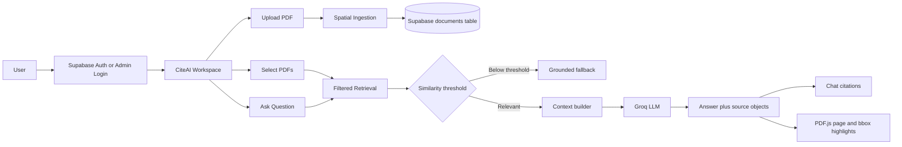
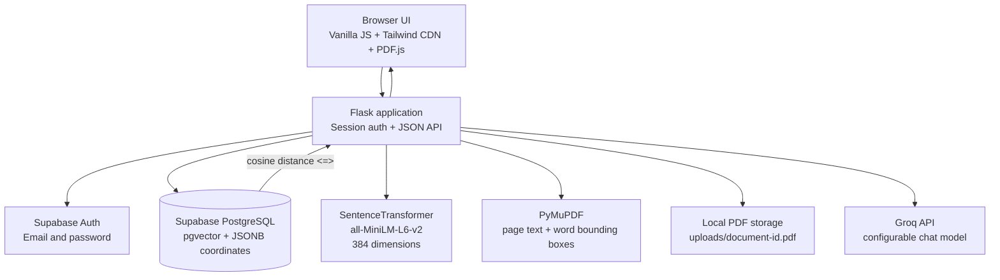
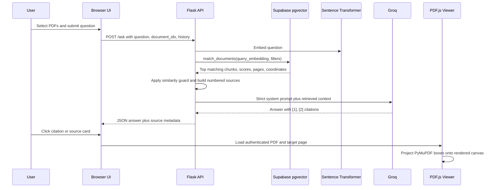

# CiteAI

> A grounded document intelligence workspace for asking questions across PDFs with page-level citations, coordinate-aware source highlighting, and multi-document retrieval.

CiteAI combines a Flask API, Supabase/PostgreSQL with `pgvector`, Sentence Transformers, PyMuPDF, Groq, and a responsive vanilla JavaScript workspace. Users upload PDFs, select one or more documents, ask questions, and inspect the supporting page and highlighted passage in an integrated PDF viewer.

## Why It Is Resume-Worthy

- Built a complete authenticated RAG product rather than a one-off script.
- Implemented page-level and chunk-level source attribution.
- Preserved PyMuPDF word coordinates for visual evidence verification.
- Added multi-document selection and grounded cross-document synthesis.
- Added Supabase Auth user login, admin access, document ownership, and deletion.
- Added a responsive chat/PDF workspace with resizable desktop panes and mobile Chat/PDF switching.
- Added an anti-hallucination similarity guard before calling the LLM.

## Product Workflow



## System Architecture



## End-to-End RAG Pipeline



## Tech Stack

| Layer | Technology | Responsibility |
| --- | --- | --- |
| Frontend | HTML, CSS, Tailwind CSS CDN, Vanilla JavaScript | Responsive workspace, chat, uploads, selection, citations |
| PDF viewer | PDF.js | Render PDF pages and highlight evidence |
| Backend | Python, Flask | Routes, sessions, validation, orchestration |
| PDF processing | PyMuPDF (`fitz`) | Page text, word coordinates, temporary file processing |
| Embeddings | Sentence Transformers | `all-MiniLM-L6-v2`, 384-dimensional vectors |
| Database | Supabase PostgreSQL | Auth, document chunks, metadata, vector storage |
| Vector search | `pgvector` | Cosine distance through the `<=>` operator |
| LLM | Groq API | Grounded answer generation |
| Storage | Local `uploads/` directory | Authenticated PDF delivery for the viewer |

## Project Structure

```text
.
├── app.py                 # Flask routes, sessions, auth, uploads, PDF delivery
├── database.py            # Supabase client and document queries
├── embeddings.py          # Cached Sentence Transformer model
├── ingest.py              # PDF extraction, chunking, bbox metadata, embeddings
├── rag.py                 # Retrieval, thresholding, context, Groq, citations
├── supabase_schema.sql    # pgvector table, RPC, ownership, policies
├── templates/
│   └── index.html         # Responsive workspace and PDF.js viewer
├── uploads/               # Runtime PDF files, ignored by Git
├── requirements.txt       # Python dependencies
├── .env.example           # Safe environment variable template
└── .gitignore
```

## Core Features

### Spatial PDF ingestion

Each page is read with PyMuPDF using word-level extraction. Every stored chunk contains:

- Document ID and owner ID
- Original filename
- Page number and chunk number
- Raw chunk text
- 384-dimensional embedding
- JSONB word coordinate records in this shape:

```json
[
  {"text": "SANJAY", "bbox": [40.0, 48.17, 82.4, 63.29]}
]
```

Coordinates remain in PDF page space. The frontend scales them against the PDF.js viewport and renders translucent overlays over the cited passage.

### Grounded retrieval

1. The question is embedded with `all-MiniLM-L6-v2`.
2. Supabase filters chunks by the authenticated owner and selected document IDs.
3. `match_documents` orders results by cosine distance.
4. The best similarity score is compared with `SIMILARITY_THRESHOLD`.
5. Low-confidence questions return a safe fallback without calling Groq.
6. Relevant chunks are numbered as `[1]`, `[2]`, and so on.
7. Groq receives only the numbered retrieved context and bounded conversation history.
8. The API returns the answer and deduplicated source objects.

### Source response shape

```json
{
  "answer": "Sanjay K is an AI/ML Engineer [1].",
  "sources": [
    {
      "id": 1,
      "document_id": "document-uuid",
      "filename": "Sanjay_K_AIML_Resume.pdf",
      "page_number": 1,
      "chunk_number": 1,
      "preview": "SANJAY K AI/ML Engineer...",
      "coordinates": [
        {"text": "SANJAY", "bbox": [40, 48, 82, 63]}
      ]
    }
  ]
}
```

## Screenshots

Add the captured workspace image to the repository at:

```text
docs/citeai-workspace.png
```

Then this README will render it on GitHub:


The workspace screenshot should show the document sidebar, chat composer, source cards, resizable divider, and PDF viewer. A second mobile screenshot can be added as `docs/citeai-mobile.png`.

## Local Setup

### 1. Prerequisites

- Python 3.10 or newer
- A Supabase project
- A Groq API key
- Git
- Internet access for the first Sentence Transformer model download

Python 3.14 is currently supported by the installed environment in this workspace.

### 2. Create and activate a virtual environment

Windows PowerShell:

```powershell
python -m venv .venv
.\.venv\Scripts\Activate.ps1
```

If PowerShell blocks activation for the current session:

```powershell
Set-ExecutionPolicy -Scope Process -ExecutionPolicy RemoteSigned
.\.venv\Scripts\Activate.ps1
```

macOS/Linux:

```bash
python3 -m venv .venv
source .venv/bin/activate
```

### 3. Install dependencies

```bash
python -m pip install --upgrade pip
pip install -r requirements.txt
```

### 4. Configure environment variables

Copy the template:

```powershell
Copy-Item .env.example .env
```

Then edit `.env`:

```env
SUPABASE_URL=https://your-project.supabase.co
SUPABASE_KEY=your-supabase-key
GROQ_API_KEY=your-groq-api-key
PORT=5000

# Use 0.45 for strict production-style rejection.
# A lower value can help very short resumes or sparse documents.
SIMILARITY_THRESHOLD=0.45
GROQ_MODEL=openai/gpt-oss-120b

ADMIN_USERNAME=admin
ADMIN_PASSWORD=replace-with-a-long-admin-password
FLASK_SECRET_KEY=replace-with-a-long-random-session-secret
UPLOAD_DIR=uploads
```

Never commit `.env`. It is excluded by `.gitignore`.

### 5. Prepare Supabase

Open **Supabase Dashboard → SQL Editor**, paste the complete contents of [supabase_schema.sql](supabase_schema.sql), and run it.

The script creates or updates:

- `pgvector` extension
- `public.documents` table
- `document_id` and `owner_id` metadata
- `coordinates jsonb` spatial metadata
- `match_documents` filtered cosine-search RPC
- Vector and ownership indexes
- Read, insert, and delete policies
- Backfill values for legacy rows

For production, replace permissive demo policies with policies based on Supabase Auth JWT claims or route all database access through a protected server key.

### 6. Start CiteAI

```powershell
.\.venv\Scripts\Activate.ps1
python app.py
```

Open:

```text
http://127.0.0.1:5000
```

The first embedding operation downloads `all-MiniLM-L6-v2` and may take longer than later requests.

## How To Use

### User workflow

1. Open the app.
2. Choose **Create account**.
3. Confirm the email if Supabase email confirmation is enabled.
4. Sign in.
5. Drop a PDF into the upload zone or browse for one.
6. Wait for indexing to finish.
7. Select one or more PDFs from the document list.
8. Ask a question in the chat composer.
9. Read the grounded answer and inline `[1]` citations.
10. Click a citation or source card.
11. Inspect the PDF page and highlighted evidence.
12. Drag the desktop divider to resize chat and PDF panes.
13. On mobile, use **PDF view** and **Chat view** to switch panels.

### Admin workflow

1. Choose the **Admin** tab.
2. Use `ADMIN_USERNAME` and `ADMIN_PASSWORD` from `.env`.
3. Review all PDFs visible to the admin workspace.
4. Upload, select, inspect, or delete documents.

The admin password is not stored in the repository. It is read from the environment at runtime.

## API Reference

| Method | Route | Auth | Purpose |
| --- | --- | --- | --- |
| `GET` | `/` | No | Render the CiteAI workspace |
| `GET` | `/auth/me` | No | Return the current Flask session principal |
| `POST` | `/auth/signup` | No | Create a Supabase email/password user |
| `POST` | `/auth/login` | No | Sign in a Supabase user |
| `POST` | `/auth/admin-login` | No | Create an environment-backed admin session |
| `POST` | `/auth/logout` | No | Clear the current session |
| `GET` | `/documents` | Yes | List accessible documents with available PDFs |
| `POST` | `/upload` | Yes | Extract, embed, store, and persist a PDF |
| `DELETE` | `/documents/{document_id}` | Yes | Delete owned/admin-visible document chunks and PDF |
| `GET` | `/documents/{document_id}/file` | Yes | Stream an accessible PDF to PDF.js |
| `POST` | `/ask` | Yes | Retrieve context and return a grounded answer |

`POST /ask` request example:

```json
{
  "question": "What projects are listed in this resume?",
  "document_ids": ["document-uuid-1", "document-uuid-2"],
  "history": [
    {"role": "user", "content": "Who is this document about?"},
    {"role": "assistant", "content": "The document is about Sanjay K [1]."}
  ]
}
```

An empty `document_ids` list means all accessible, renderable documents.

## Running Checks

```powershell
.\.venv\Scripts\python.exe -m py_compile app.py database.py embeddings.py ingest.py rag.py
node -e "const fs=require('fs'); const html=fs.readFileSync('templates/index.html','utf8'); const scripts=[...html.matchAll(/<script(?:[^>]*)>([\s\S]*?)<\/script>/g)]; new Function(scripts.at(-1)[1]); console.log('frontend application script: OK')"
```

The project has also been checked with Flask route smoke tests, real PDF.js rendering, responsive viewport checks, and in-memory PyMuPDF bounding-box extraction.

## Troubleshooting

### `Could not find the table public.documents`

Run [supabase_schema.sql](supabase_schema.sql) in the Supabase SQL Editor, then restart Flask.

### `Missing PDF /documents/{id}/file`

The database row exists but the corresponding `uploads/{document_id}.pdf` file does not. Re-upload the PDF. The app hides indexed records whose local PDF is unavailable.

### The answer falls back too often

Check `SIMILARITY_THRESHOLD`. The requested strict value is `0.45`, but very short or visually sparse resumes may produce lower embedding similarity. Tune it carefully and keep the fallback for safety.

### Groq model not found

Set `GROQ_MODEL` to a model available to your Groq account. The current working configuration uses `openai/gpt-oss-120b`.

### Coordinates are empty

Run the updated schema, then re-upload the PDFs. Legacy rows can be backfilled structurally but cannot recover coordinates that were never stored.

### Tailwind CDN warning

The current prototype uses Tailwind via CDN for zero-build setup. For production deployment, compile Tailwind with the CLI/PostCSS and pin the PDF.js asset version locally.

## Security Notes

- Rotate any API key that has been exposed during development.
- Do not commit `.env`, PDFs, or `uploads/`.
- Use a long random `FLASK_SECRET_KEY`.
- Replace the demo admin password before deployment.
- Move PDF storage to Supabase Storage or private object storage in production.
- Tighten Supabase RLS policies; the included policies are designed for this server-mediated demo.
- Add rate limiting, CSRF protection, HTTPS, and structured logging before public deployment.

## Resume Description

**CiteAI — Spatial PDF RAG Workspace**

Built a full-stack retrieval-augmented generation application using Flask, Supabase pgvector, PyMuPDF, Sentence Transformers, Groq, and PDF.js. Implemented authenticated multi-user document management, 384-dimensional semantic retrieval, cosine-threshold hallucination prevention, page-level citations, word-level PDF bounding-box indexing, clickable source verification, multi-document synthesis, and responsive resizable chat/PDF interfaces.

## License

Add the license that matches how you plan to publish this project.
